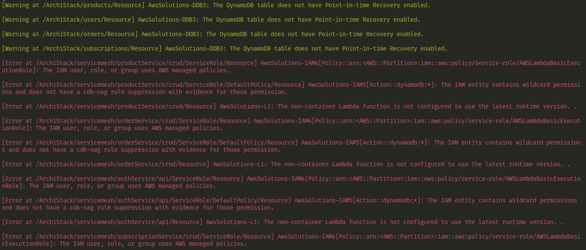
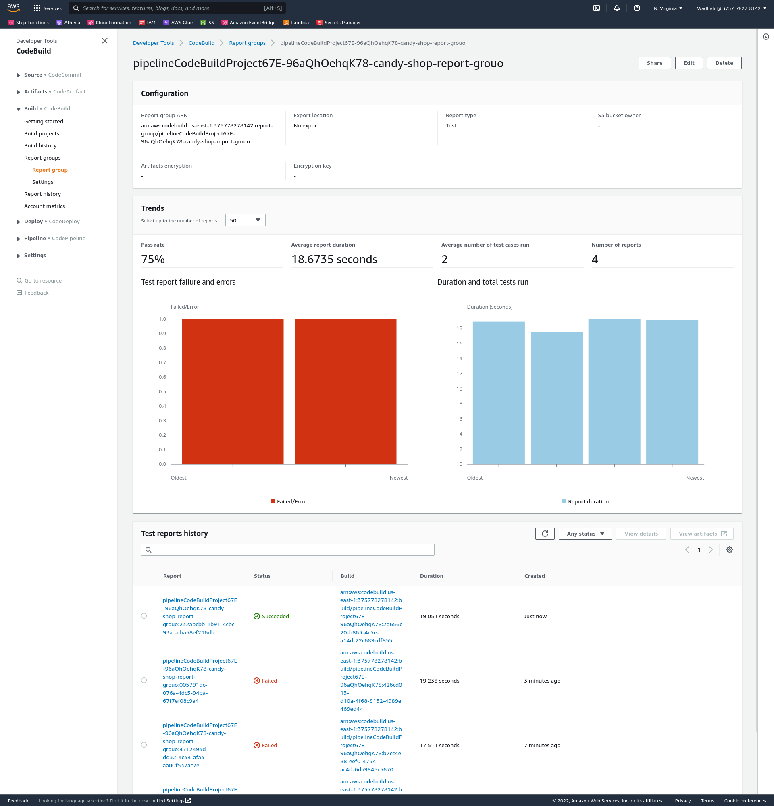

# Candy shop backend

This is infrastrcture as code project Generated using the AWS CDK.
Its main functionality is to translate TS code into Cloudformation Template and deploy it on AWS.

You can find the generated final template in template.yml

## AWS CDK

The AWS Cloud Development Kit (AWS CDK) is an open-source next generation software development framework to define cloud application resources using familiar programming languages.

## Project Parts

This Project is devided into services, a comman API Gateway alongside with DyanamoDB table. It relies on constructs to devide the resources into relevant groups.

A construct is like components for infrastrcture, it reduces boilerplate and helps in code reuse.

## Testing project

The main interest in testing CDK projects is :

- Integration Testing : Lambda function

- System Testing : Template Code Generation

- Static testing using CDK Nag for security and best practises


### Integration Testing : Lambda function

We are testing to see if the item creation lambda succeeds with status code of 200
Jest is used for this test with file : test/createOne.test.ts

```typescript
const event = JSON.parse(fs.readFileSync("test/create.event.json", "utf-8"));
test("Can Create One Product", async () => {
  const result = await createOne(event, "products");
  expect(result).toMatchObject({ statusCode: 200 });
  return result;
});
```

### Template code generation

Our resource template contains a lot of resources and with adding more constructs making sure that the desired new resource is present manually grows harder.

The solution is to generate the template and test for its presence.

In the following example we are going to check if table with proper name resource is generated

```typescript
test("Check for dynamodb table creation in template", () => {
  // Launch the cdk process and generate stack object
  const app = new cdk.App();
  const stack = new Archi.ArchiStack(app, "MyTestStack");

  // Get standard Cloudformation template from stack
  const template = Template.fromStack(stack);

  /** search explicitely for table named products  */
  template.hasResource("AWS::DynamoDB::Table", {
    Properties: { TableName: "products" },
  });
});
```

### Static testing with CDK Nag

CDK nag check generated template for security and linitng issues. It first demands a generated project and the integration is pretty straight forward

```typescript
Aspects.of(app).add(new AwsSolutionsChecks());
```

Every time the project is built & the template is synthesised from code the analysis tool is run and outputs the audit result


## Devops Project

The CDK pipeline will consist of building the project, performing the tests and deploying it.
We will be using AWS codepipeline for the pipeline.

For testing result we are going to use AWS report groups to showcase our tests and monitor them here's an example of pipeline run



You can find the pipeline full code in lib/pipeline/PipelineConstruct.ts

The pipeline is divided into 3 parts :

- Sourcing the code from github with a oauth2 token.

- Test the project using jest in CodeBuild Project with AWS Standard linux image.

```yaml
version: 0.2
phases:
  install:
    runtime-versions:
      nodejs: '14'
    commands:
    - n 16
    - npm install -g pnpm
    - pnpm install
  pre_build:
    commands:
    - echo initialise...
  build:
    commands:
    - echo Build started on `date`
    - npm run test-ci
reports:
  candy-shop-report-grouo:
    files:
    - junit.xml
    file-format: JUNITXML

```

- Test the project using npm  & Cloudformation in CodeBuild Project with AWS Standard linux image.

```yaml
version: 0.2
phases:
  install:
    runtime-versions:
      nodejs: '14'
    commands:
    - n 16
    - npm install -g pnpm
    - pnpm install
  pre_build:
    commands:
    - echo initialise...
  build:
    commands:
    - echo Build started on `date`
    - npm run cdk deploy

```
